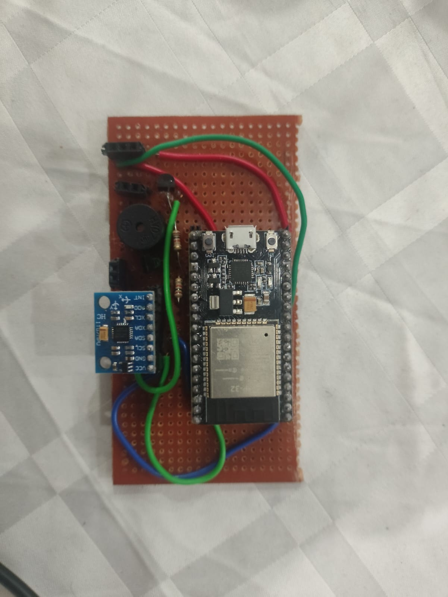
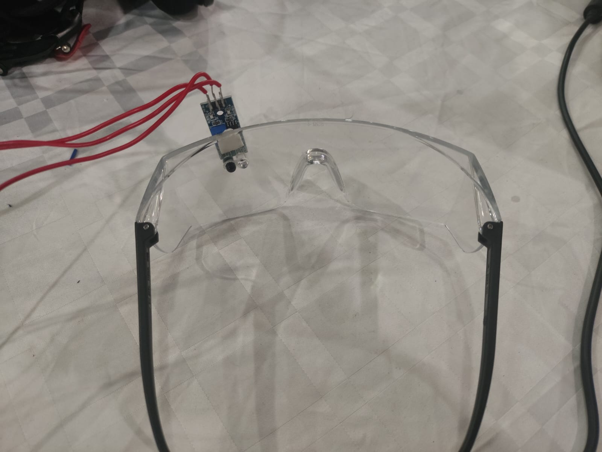
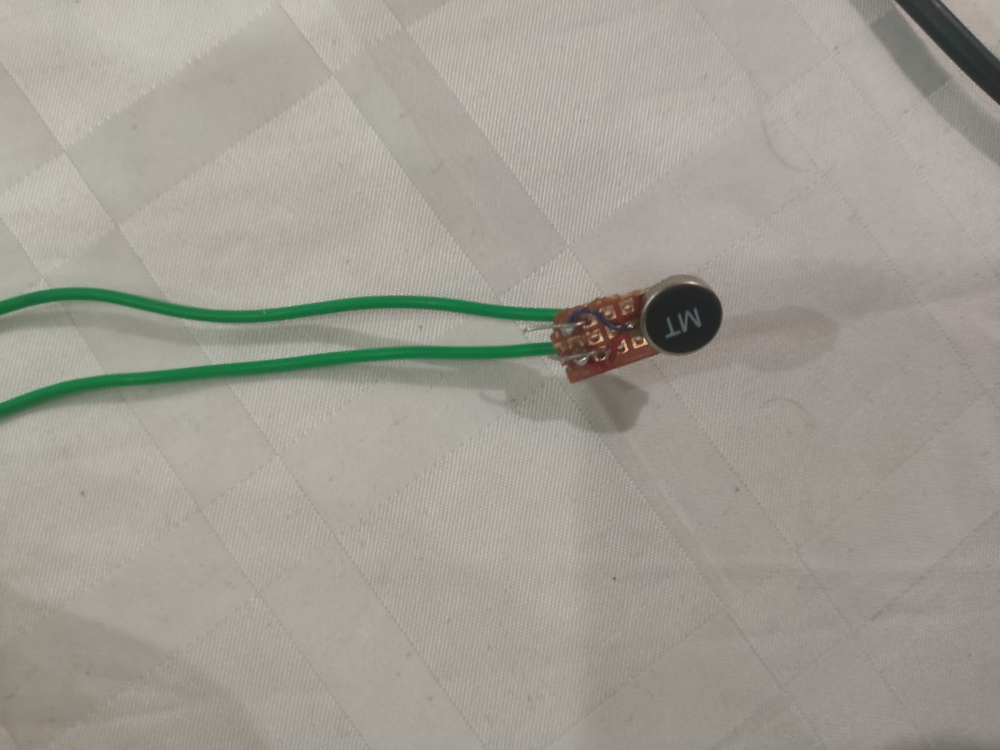
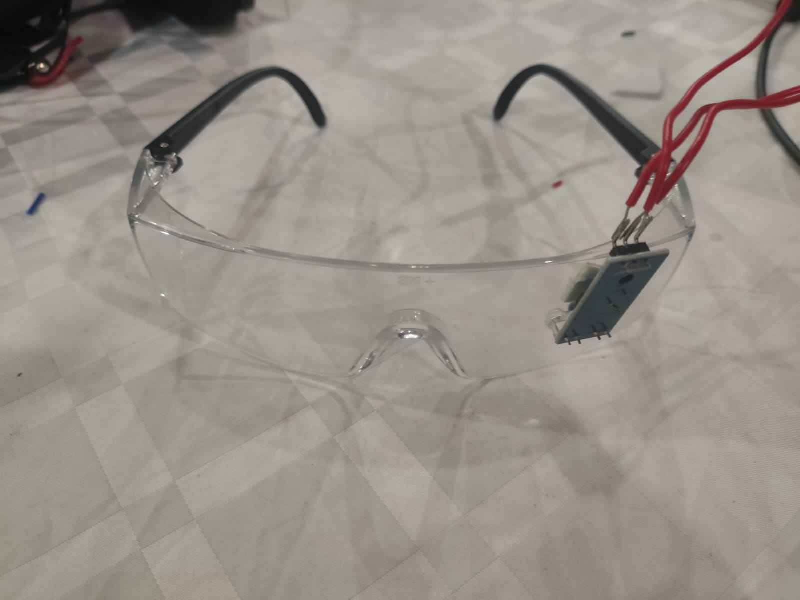
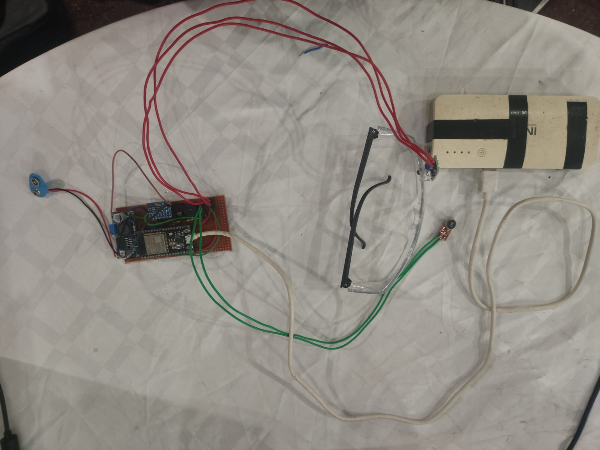
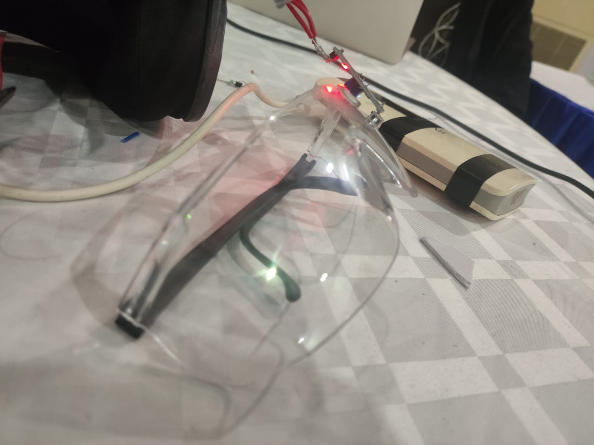
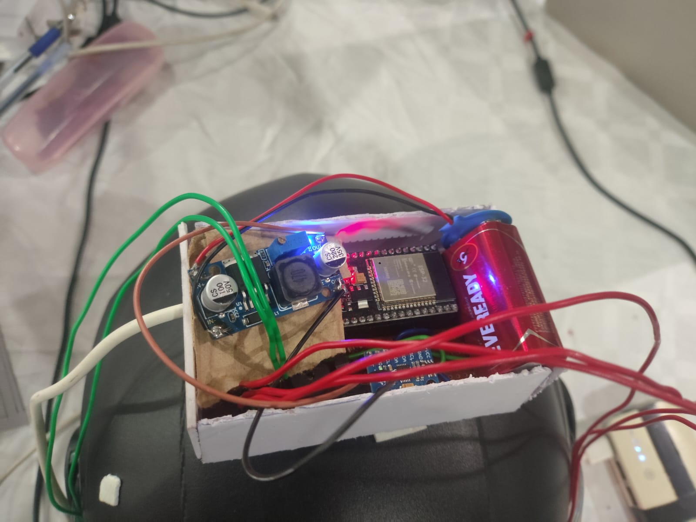
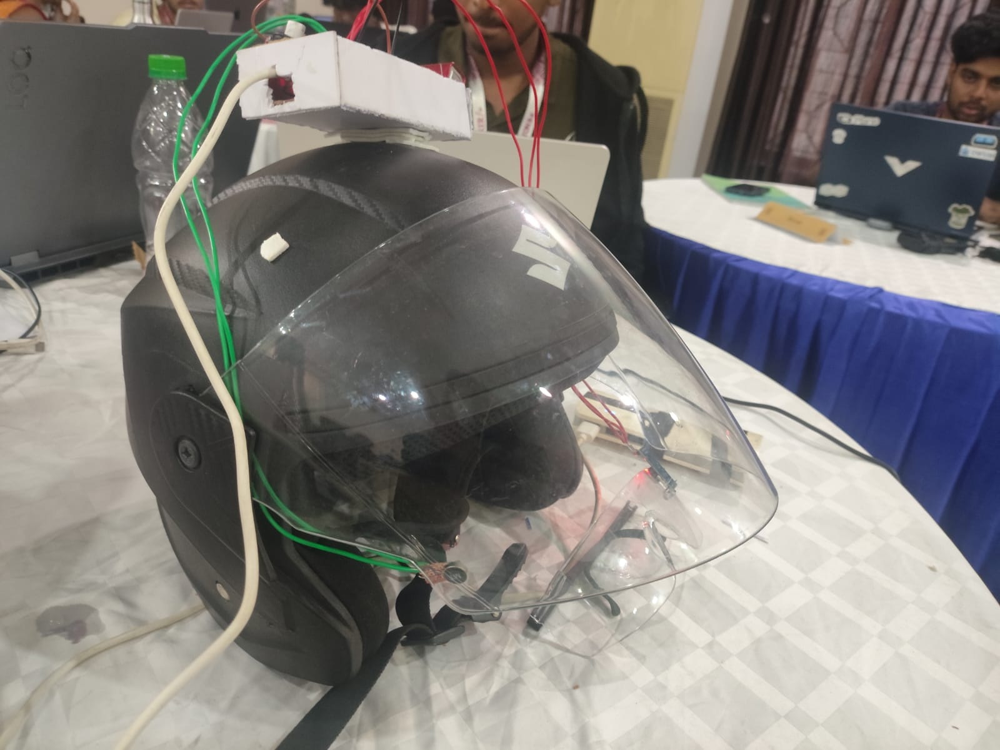

# VigilX
## An ESP32 based Accident & Drowsiness Monitoring System

An **ESP32-based smart safety system** that detects accidents, falls, and drowsiness by fusing **eye-blink detection**, **tilt angle**, and **angular speed**. The system provides **local alerts (buzzer + vibration)** and sends **BLE emergency notifications** with severity classification.

---

## 📌 Features

- 👁️ **Eye Blink / Drowsiness Detection** using IR sensor  
- 📐 **Tilt Angle Estimation** using MPU6050 (Complementary Filter)  
- ⚡ **Sudden Rotation / Impact Detection** using gyroscope  
- 🧠 **Dynamic Risk Scoring** with adaptive sensor weighting  
- 🔊 **Local Alerts** (Buzzer + Vibration Motor)  
- 📡 **Bluetooth Low Energy (BLE)** accident reporting  
- 🧾 **JSON-based Emergency Messages** with severity levels  

---

## 🛠️ Hardware Requirements

| Component | Description |
|--------|-------------|
| ESP32 | Main microcontroller with BLE |
| MPU6050 | Accelerometer + Gyroscope |
| IR Eye Blink Sensor | Eye open/close detection |
| Buzzer | Audio alert |
| Vibration Motor | Haptic alert |
| Jumper Wires | Connections |

---

## 🔌 Pin Configuration

| ESP32 Pin | Component |
|---------|----------|
| GPIO 27 | IR Eye Blink Sensor |
| GPIO 4 | Buzzer |
| GPIO 2 | Vibration Motor |
| GPIO 21 | SDA (MPU6050) |
| GPIO 22 | SCL (MPU6050) |

---

## ⚙️ Working Principle

The system continuously reads sensor data and calculates **three independent risk scores**:

1. **Blink Score** – Based on eye closure duration  
2. **Tilt Score** – Based on head/device pitch angle  
3. **Speed Score** – Based on angular rotation speed  

These scores are combined into a **Total Risk Score** using **dynamic weights**.

```text
Total Risk = (Blink × Weight) + (Tilt × Weight) + (Speed × Weight)
````

If the IR sensor becomes unreliable, the system **automatically reduces its weight** and relies more on motion sensors.

---

## 🚨 Alert Logic

| Risk Score | Status  | Output             |
| ---------- | ------- | ------------------ |
| < 40       | NORMAL  | No alert           |
| 40–75      | WARNING | Vibration only     |
| > 75       | DANGER  | Buzzer + Vibration |

---

## 🚑 Accident Detection Conditions

An accident is detected if **any** of the following occurs:

* Tilt score > 85%
* Angular speed score > 90%
* Total risk score > 85%

Once detected:

* Alerts are activated
* BLE emergency message is sent **only once**

---

## 📡 BLE Emergency Message Format

The ESP32 sends accident data as a **JSON notification**:

```json
{
  "accident": "YES",
  "severity": "CRITICAL",
  "message": "Severe crash detected. Immediate medical attention required."
}
```

### Severity Levels

* `MODERATE`
* `HIGH`
* `CRITICAL`

---

## 🧠 Sensor Fusion Technique

A **Complementary Filter** is used to:

* Reduce accelerometer noise
* Correct gyroscope drift
* Produce stable pitch angle estimation

---

## 📁 File Structure

```text
.
├── src/
│   └── main.cpp   # Main ESP32 program
├── README.md
```

---

## 🚀 How to Use

1. Connect all components according to pin table
2. Upload the code using **Arduino IDE**
3. Connect to BLE device named:

   ```
   ESP32_ACCIDENT_MONITOR
   ```
   Using the VigilX app.
4. Monitor alerts and BLE accident notifications

---
## Images







<!--  -->


---
## 🔮 Future Improvements
* ☁️ Cloud-based emergency logging
* 🔋 Battery monitoring & power optimization
* 📞 Automatic SMS or call alerts
---

## 👨‍💻 Authors

***Meera RS, Karthik M Raj, Vidya SR and Asiya Badusha***